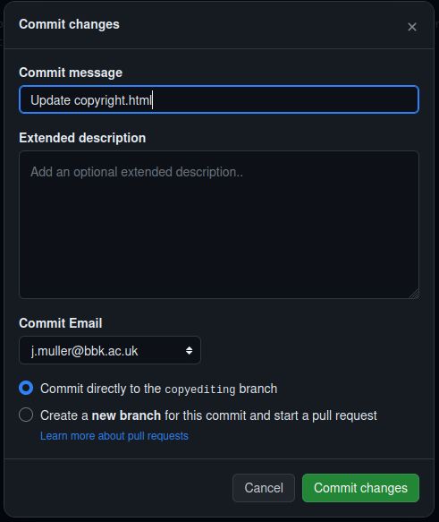

# Hourglass Theme for Janeway

## Installing

1. Clone this repository into the theme folder of your
   [Janeway](https://github.com/BirkbeckCTP/janeway) installation:

   ```shell
   cd src/themes
   git clone git@github.com:BirkbeckCTP/hourglass.git
   ```

2. With your Python virtual environment activated, install the Python
   dependencies using pip.

   ```shell
   pip install -r requirements.txt
   ```

3. Install the JavaScript dependencies using NPM:

   ```shell
   npm install
   ```

   You should see a new `node_modules` file in the `hourglass` folder.

4. Add the app name to your `INSTALLED_APPS` in `settings.py`:

   ```py
   INSTALLED_APPS = [
       ...,
       'themes.hourglass',
       ...,
   ]
   ```

5. Make changes to settings for `django-components`, mostly according to the
   [installation
   instructions](https://github.com/EmilStenstrom/django-components/tree/d9342782266b6ec41e3f2c39229d71d975f809a2#installation)
   However, do *not* apply caching with `loaders.cached.loader`. Instead,
   use these loaders:

   ```py
   'loaders': [
       'utils.template_override_middleware.Loader',
       'django.template.loaders.filesystem.Loader',
       'django_components.template_loader.Loader',
       'django.template.loaders.app_directories.Loader',
   ],
   ```

6. Make changes to settings for `django_minify_html` if desired according to the
   [installation
   instructions](https://github.com/adamchainz/django-minify-html#installation)

## Deploying to production

From the Janeway root, build assets for all themes:

```shell
python src/manage.py build_assets
```

You can call the same command via NPM in the theme root:

```shell
cd src/themes/hourglass
npm run build
```

## Updating in production

```shell
cd src/themes/hourglass
git pull
pip install -r requirements.txt
npm install
python ../../manage.py build_assets
```

## Developing

### CSS

Use Tailwind classes in the HTML templates to apply styling.

In the rare case you need to apply a style to the base layer or define
a custom component, make changes to `src/input.css` using `@layer` and
`@apply` commands.

When making lots of small CSS changes that you want to see in the browser
during development, you can use the hot replacement (HMR) feature provided
by Tailwind. To watch for changes and recompile the CSS based on classes
used automatically, use this NPM command:

```shell
npm run dev
```

This should work smoothly with the `django-browser-reload` configuration
in Janeway so that you only have to save the HTML file you’re working in
to see the changes take place in the browser. Templates and static CSS
files are both watched and can trigger reloads independently.

#### Styling notes

Each section of content is given a container and relative positioning, so
that it can be used as an anchor for background colors and images.

Z-index is used as follows:

- `-z-10` for the solid light tan background

- `z-0`, `z-10`, and `z-20` for the constructivist collages of geometric shapes and cut-out photos

- `z-30` for pseudo-elements used to extend alternate color backgrounds
outside the container to the edge left and/or right

- `z-40` for the content layer, along with its immediate, in-container
background color

- `z-50` for the sticky desktop nav so it is persistent on top of
everything else

### JavaScript

Modify the files in `js` and rerun `build_assets`.

New files need to be added to `OTHER_SOURCE_FILES` in `build_assets.py`.

### Code styling and linting

The repository is set up with a few formatters and linters:

- [Standard](https://standardjs.com/) for JavaScript

- [djhtml](https://github.com/rtts/djhtml) for Django template file indentation,
  using 2-space-indents to better handle long Tailwind class lines

Please run these two commands before pushing:

```shell
standard --fix
djhtml --tabwidth 2 templates
```

We haven’t enforced them as a pre-commit hook, because we’d need to
discuss the implications of that first.

## Copyediting and Content Changes

All the content for this theme is stored in GitHub, rather the Janeway content
management system. You can propose changes in GitHub by following these steps:

1. Make sure you have a GitHub account and that you’ve been added to an OLH
   GitHub team with the right access.

2. Make sure you have a Janeway account for the installation that you want
   to edit and that your account has staff access.

3. While logged in to the website, find the live page you want to edit,
   and click on the “Edit on GitHub” link. You should be taken to the
   GitHub page with the source code. You should also see the name of the
   branch at the top of the page, after the file path.

   

4. Edit the file, and then select “Commit changes”. Enter a commit
   message, and leave “Commit directly to the copyediting branch”
   selected. Select “Commit changes”.

   

5. Open a pull request from the copyediting branch to the main branch. Or
   just ask a member of the tech team to do so for you. They will review
   your edits and merge them into the live version of the website.

## Engineering

As an alternative, we could use
[django-tailwind](https://github.com/timonweb/django-tailwind).

## Licensing

The code in this repository is licensed under AGPL 3.0.

Unless otherwise stated, the original textual content and visual designs
in this repository are the copyright of Birkbeck, University of London,
and they are licenced under a [Creative Commons Attribution 4.0
International License](https://creativecommons.org/licenses/by/4.0/) (CC
BY 4.0). The Open Library of Humanities and its logos are registered
trademarks.

The attribution-required and trademarked content is restricted to the
following folders:

- `templates/custom/*`

- `components/*`

- `src/media/*`

The CC BY license lets you share and adapt these materials so long as you
properly credit the source. Proper attribution of the OLH must be given in
the following manner:

- Attribute the materials wherever they appear, including published
  end-product websites.

- Spell out the full name of the Open Library of Humanities and provide
a link to our website, as in one of these examples:

  - “The Open Access Movement” was first published by the Open Library of
Humanities, openlibhums.org

  - Diamond open access diagram by the
    [Open Library of Humanities](https://www.openlibhums.org/)

- Display the attribution so that it is clearly visible and easily
  legible, not obscured or hidden, with text that is the same size as the
  main text in your work, or a minimum of 12pt (print) or 18px (web),
  whichever is larger

- Under no circumstances may your use or attribution of our materials
  misconstrue the Open Library of Humanities as a publisher of your works
